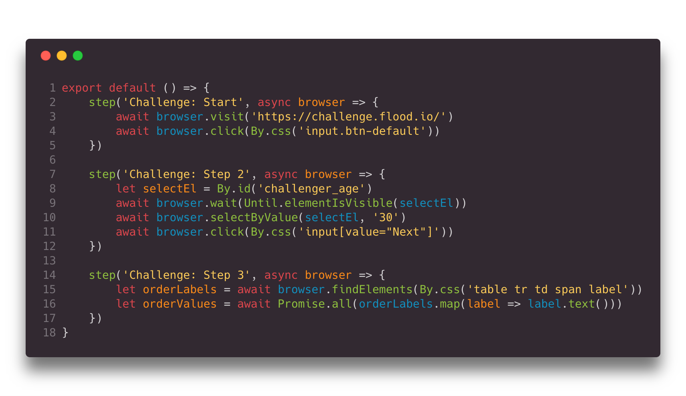

# `@Flood/element`

Flood Element brings the familiar power of traditional browser scripting tools with the proven performance of Flood to create an easy to use and maintainable performance testing tool.

Flood Element works by spinning up hundreds or even thousands of instances of Google Chrome, and running scripts you define here to drive a load test. We can this Browser Level Load Testing.

> This project is currently in beta and APIs are subject to change.



# Quickstart

## 1. Download Flood CLI

**On macOS**, install using homebrew:

```bash
brew install flood-io/taps/element
```

If you're familiar with node.js development and already have it installed:
```bash
npm install -g @flood/element-cli
# or
yarn global add @flood/element-cli
```

**On Windows:**

We're still working on a Windows build, stay tuned.

## 2. Initialize Project

```bash
# Initialize a new project
element init my-flood-element-test
# follow the prompts

# once its done, change directory into my-flood-element-test
cd my-flood-element-test
```

### if you already have a project

you may want to generate a starter test script:
```bash
element generate test.ts
```

To get the TypeScript types, e.g. to use enhanced type checking and documentation in your editor, add `@flood/element` to your project:
```bash
npm add --save-dev @flood/element
# or
yarn add -D @flood/element
```

## 3. Write and validate your script

Edit `test.ts` in your editor of choice. To learn more about the scripting capabilities we've put together a detailed tutorial on [testing the "Flood Merchandise Store"](examples/scenario_1_wordpress.md).

We recommend an editor with good TypeScript support such as [Visual Studio Code](https://code.visualstudio.com/). 
Using this kind of editor helps to speed up writing your test script by providing code completion, in-place help and type checking.

As you're writing your script, you can validate it by running it:

```bash
element run test.ts
```

This will output a detailed list of steps and configuration options it has read from your script, then execute it within the Flood Element Environment.

TODO watch


## 4. Run a real Load Test on [Flood](https://flood.io)

In future releases, you'll be able use your test script as a Load Test on Flood directly from the Flood Element CLI.

For now, please use the [Flood site](https://app.flood.io) to execute your test -- upload it to [Flood](https://flood.io/app) as a new Stream and launch a Flood (a test).


Continue learning more Flood Element techniques by starting with our API documentation. The main entry point to all tests is the <[Browser]> class and it's a great place to get a feel for the capabilities of each test.

# Why?

Over the years, countless customers have mentioned that getting started with Load Testing is a daunting task. That's why it's often left until the last minute before launch. At Flood, it's our mission to make Load Testing less daunting and accessible to everyone. We want to give developers and testers an easy way to ensure that whatever part of the system they're responsible for meets expectations for both functionality and performance.

# What can I do with it?

* Flood Element can be used to **put load on any web accessible application** and measure how it performs as load is ramped up,
* **Measure performance regressions** after deploys by integrating it with you CI/CD pipeline,
* Measure how your application's response time from different regions as experienced by your customers,
* Create **realistic load scenarios** which stress test your network infrastructure without developing a complex protocol level load test scripts.

# Documentation

* [Deep dive tutorial](examples/scenario_1_wordpress.md)
* [API Documentation](api/Browser.md)

# Reporting Issues

If you encounter any issues with the `@flood/element` project or Flood Element product, please [open an issue](https://github.com/flood-io/element/issues) on the GitHub project.

If you're encountering issues with Flood itself, please contact Flood Support from within the Flood Dashboard.
