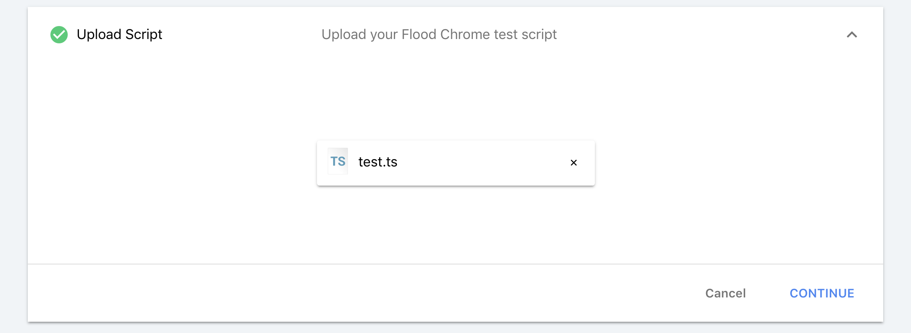

# `@flood/element`

Flood Element combines the familiar power of traditional browser scripting tools with the proven performance of Flood to create an easy to use and maintainable performance testing tool.

Flood Element works by spinning up hundreds or even thousands of instances of Google Chrome, and running the scripts you write using `@flood/element` to drive a load test. We call this Browser Level Load Testing.

> This project is currently in beta and APIs are subject to change.


- [Quickstart](#quickstart)
  - [1. Install Element](#1-install-element)
  - [2. Initialize Your Project](#2-initialize-your-project)
  - [3. Write and Validate Your Script](#3-write-and-validate-your-script)
  - [4. Run a Real Load Test on Flood](#4-run-a-real-load-test-on-flood)
- [About](#about)
  - [What can I do with it?](#what-can-i-do-with-it)
- [Repository Layout](#repository-layout)
- [Documentation](#documentation)
- [Reporting Issues](#reporting-issues)

## Quickstart

### 1. Install Element

**Install using NPM:**

First, make sure you have installed the [latest version of NodeJS](https://nodejs.org) for your platform.

```bash
# Using yarn
yarn global add @flood/element-cli

# Using npm
npm install -g @flood/element-cli

# Verify install
element --version
```

### 2. Initialize Your Project

Using the `element` command, you can generate a new project or generate a test within your existing project.

**Generate a new project**

```bash
element init ./my-element-project
```

This will create a new project an test.ts file with a single step stubbed out for you.

**Or, generate a new file**

```bash
element generate load-test-dashboard
```

This will create a new file with a single step stubbed out for you.

### 3. Write and Validate Your Script

Edit `test.ts` in your editor of choice. To learn more about the scripting capabilities we've put together a detailed tutorial on [testing the "Flood Merchandise Store"](./examples/scenario_1_wordpress.md).

As you're writing your script, you can validate it by running it locally using `element run`:

```bash
element run test.ts
```

This will run the script in an instance of Chrome and output the results locally.

For details of the available options see the [`element run`](./../../cli/README.md#element-run) guide.

## 4. Run a real Load Test on [Flood](https://flood.io)

Now that you have a test script, upload it to [Flood](https://app.flood.io) as a new Stream and launch a Flood (a test).



Continue learning more Flood Element techniques by starting with our [API documentation](./SUMMARY.md). The main entry point to all tests is the [Browser](./api/Browser.md) class and a great place to get a feel for the capabilities of each test.

## About

Over the years, countless customers have mentioned that getting started with Load Testing is a daunting task. That's why it's often left until the last minute before launch. At Flood, it's our mission to make Load Testing less daunting and accessible to everyone. We want to give developers and testers an easy way to ensure that whatever part of the system they're responsible for meets expectations for both functionality and performance.

### What can I do with it?

- Flood Element can be used to **apply load to any web accessible application** and measure how it performs as the load is ramped up.
- **Measure performance regressions** after deploys by integrating it with your CI/CD pipeline.
- Measure your application's response time from different regions as experienced by your customers.
- Create **realistic load scenarios** which stress test your network infrastructure without developing complex protocol level load test scripts.

## Repository Layout

Flood Element is developed as a monorepo and comprises two packages:

- [`@flood/element`](./..) is the library implementing the Element API.
- [`@flood/element-cli`](./../../cli) wraps up the library for you to use from the CLI to develop and debug test scripts.

When you run your script as a load test on [Flood](https://app.flood.io), this same `@flood/element` package is used to execute the test.

## Documentation

- [Deep dive tutorial](./examples/scenario_1_wordpress.md)
- [Browser API Documentation](./packages/element/docs/api/Browser.md)
- [API Documentation](./SUMMARY.md)

## Reporting Issues

If you encounter any issues with the `@flood/element` project or Flood Element product, please [open an issue](https://github.com/flood-io/element/issues) on the GitHub project.

If you're encountering issues with Flood itself, please contact Flood Support from within the Flood Dashboard.

[flood]: https://flood.io
[browser]: ../../api/Browser.md#browser

